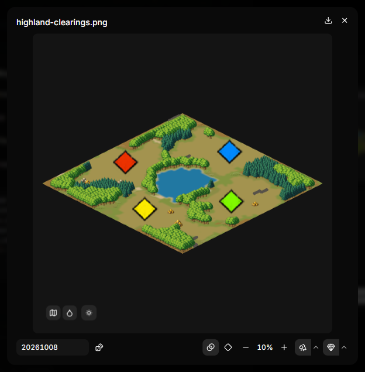
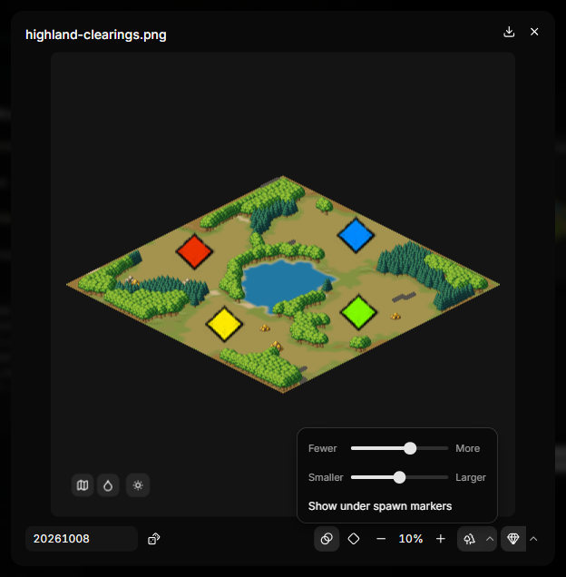
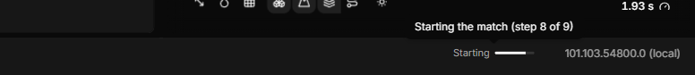

# Deploying and live testing

When your map is ready to play, AoE2RMSIDE can copy it into a local mod that
the game lists under custom maps. If you have AoE2Control, it can also start
the map in the running game for you.

Both are optional. The [preview](preview.md) and [map tests](map-tests.md)
work without the game, and you can always copy your files by hand.

| Feature | Needs a linked game folder | Needs AoE2Control | Needs the game running |
|---|---|---|---|
| Preview and map tests | No | No | No |
| Deploy a mod | Yes | No | No |
| Live test | Yes | Yes | Yes |

## Deploy your map as a mod

1. Choose **File → Deploy as Mod…** (Ctrl+Shift+B), or right-click the
   map's editor tab and choose **Deploy as Mod…**.
2. Check the settings in the dialog:
    - **RMS source:** the map to deploy. The list shows your open `.rms` and
      `.rms2` files.
    - **Mod name:** the name of the mod folder. Use the arrow next to it to
      reuse the name of an earlier export.
    - **User profile:** the game profile to install the mod for. The IDE
      suggests one.
    - **Target directory:** the folder the mod folder goes into. The folder
      button next to it opens it in Windows Explorer.
    - **Map icon** (to the right of the fields): see [Map icons](#map-icons)
      below.
    - **Enable mod** (next to **Deploy mod**): leave it on to have the IDE
      turn the mod on in the game's mod list for that profile. It changes
      only this mod's entry, and the IDE remembers the choice.
      <!-- VERIFY-AT-PUBLISH: maintainer's new-mod Enable mod check -->
3. Look through the file tree. It shows which files the mod will
   contain.
4. Press **Deploy mod**.

After deploying, the confirmation shows the mod's folder. **Open mods
folder** shows it in Windows Explorer; **Finish** (or Enter) closes the
confirmation.

The game shows a new map and its icon only after it restarts. Restart the
game after deploying. With **Enable mod** off, enable the mod yourself in the
game under **Mods → My Mods**, then restart the game. If the game was running
while you deployed, it may undo the change when it closes. If the mod is off
after the restart, close the game and deploy again. If the IDE cannot read the
game's mod list, it leaves the list unchanged, tells you why, and the mod is
still deployed.

The mod is written to the game's local mods folder:

```text
%USERPROFILE%\Games\Age of Empires 2 DE\<profile>\mods\local\<Mod name>\
```

The dialog's **Target directory** shows the `mods\local` folder the mod goes
into and lets you copy it. The folder button to its right opens that folder in
Windows Explorer, so you can quickly reach your local mods. Before your first
deployment for a profile the folder may not exist yet; the button then opens
the closest folder above it in that profile. After deploying, the confirmation shows the mod's
own folder, which you can copy too.

### What goes into the mod

- your map (`.rms` or `.rms2`);
- the include files your map uses from your own folder;
- the XS files your map loads with `#includeXS`, in the mod's
  `resources\_common\xs` folder under the name your `#includeXS` line uses,
  which is where the game looks for them;
- the `info.json` file the game needs for a local mod;
- the map icon, if you choose one.

Nothing else is copied. Map tests, reports, settings and other files in your
folder stay out of the mod. The game's own include files and XS files are not
copied either, because every player already has them.

If one of your XS files has syntax errors, the IDE does not deploy. The
dialog names the file and line, for example **start.xs has XS syntax
errors**. Fix the errors listed in Problems, then deploy again. Live tests
check the same before they change anything in the game.

If the preview does not already show the selected map, opening the dialog
generates it. That way the IDE deploys the files the map used.

If a mod with the same name already exists, the IDE asks before replacing it.

### Play it in the game

In the game's lobby, set the map style to **Custom** and pick your map. If it
does not show up, see
[the FAQ](faq.md#common-problems).

## Map icons

The game shows a PNG with the same file name as your map as its icon in the
map list. AoE2RMSIDE can make that icon for you.

Turn on **Generate map icon** in the deploy dialog. The button and the icon
below it form one box: while generation is on, the button shows a check mark
and the whole box has a stronger fill. Clicking the icon itself also turns
generation on (see below). The IDE draws a
512×512 image from the generated map: the terrain, cliffs, trees, gold and
stone, and a marker for each player's start. Other objects are left out, like
in the game's own map icons. The icon you see is the icon that is saved and
deployed.

Point at the icon to show **Save image…** in its top-right corner.

Click the icon to enlarge it. If **Generate map icon** is off, clicking the
icon turns it on. The buttons in the bottom-left corner of the
enlarged icon change how it is drawn:

- **Top-down view** / **Diamond view** draws the icon like the preview's
  perspective: the square-tiled diamond or the flatter 2:1 diamond.
- The look button switches between **Minimap colors** and **Texture colors**
  (the default), like the preview's
  [Look](preview.md#perspective-and-look).
- **Terrain relief** shades the terrain by its height.

Below the enlarged icon you can also:

- choose the seed the icon is drawn from, roll a **Random seed** (the dice),
  or go back with **Use editor seed**;
- switch **Smooth terrain transitions** on or off;
- choose the spawn markers: each click on the marker button moves on from
  **Player squares** (the default) to **Nomad feet** to **No spawn markers**.
  The size next to it sets how large the markers are, as a share of the map
  width;
- choose how trees, and gold and stone, are drawn (below).

All choices are remembered for the next icon.

If your folder already has a PNG with the same name as your map, the IDE uses
yours by default. Turning on **Generate map icon** replaces it in the mod
only; your own file is not changed.



### Trees, gold and stone

The last two buttons below the enlarged icon are **Show trees** and
**Show gold and stone**. Click one to show or hide that kind of graphic. The
graphics are drawn for AoE2RMSIDE in the style of the game's map icons; they
are not taken from the game.

- **Trees** are drawn in groups. Each group shows the tree kind that grows
  there most, for example pine, palm or snow pine, or a plain tree when
  there is no better match.
- **Gold and stone**: each pile of mines is drawn as one graphic at its
  middle, a larger one for piles of five tiles or more.

The narrow arrow next to each button opens a small menu with the same three
controls for that kind:

- an amount slider from **Fewer** to **More**. At **More**, nearly every
  object gets its own graphic. Toward **Fewer**, nearby groups merge, and at
  the end there is a single graphic for each kind (one tree, one gold,
  one stone) at the average position of all of them;
- a size slider from **Smaller** to **Larger**. It changes how large the
  graphics are, not where they stand;
- **Show under spawn markers**. Graphics are always drawn behind the spawn
  markers. By default, graphics that a spawn marker would cover are left
  out; turn this on to keep them.

The icon is drawn again when you let go of a slider.

Nothing in the icon crosses the edge of the map. A graphic that would stick
out is moved inward, or left out if it would have to move further than its
own size. Spawn markers are moved inward too, but never left out.



!!! tip "Give your map a unique file name"
    If your map has the same file name as one of the game's own maps, the game
    may show the built-in map's icon instead of yours.

## Live testing with AoE2Control

Live testing starts your map in the running game with the seed and settings
from the preview. It saves you from setting up the lobby by hand each time.

### What you need

- A linked game folder.
- AoE2Control **1.1.0 or newer**, installed separately. AoE2RMSIDE does not
  include it. Saxons, Varangians and Danes need AoE2Control **1.1.1 or
  newer** and a game version that has them. The lobby options (game mode
  modifiers, Turbo, Full tech tree, Antiquity and Solid farms) need
  AoE2Control **1.1.1 or newer** too; with an older AoE2Control a live test
  with any of them on stops before it changes anything in the game, and
  Output says "This AoE2Control version can't set lobby options".
- Age of Empires II: DE running, in single player. AoE2RMSIDE never starts
  the game for you and refuses to act in multiplayer.
- One of the verified game versions (see
  [Which game versions are supported?](faq.md#game-versions-and-compatibility)).
  Other versions are refused with "This game version is not supported for
  live testing."
  <!-- VERIFY-AT-PUBLISH: Task 47 (live testing accepts exactly the versions
  of the profiles shipped with the release) -->

### Set it up

1. Open the Run options (the arrow next to the Run button).
2. Choose **Select AoE2Control** and select the AoE2Control executable
   (installing it: [Installation](../getting-started.md#installation)).
   (Without a linked game folder, this row offers **Select game folder**
   first.)
   The download button next to it opens the
   [AoE2Control releases page](https://github.com/aoe2control/AoE2Control/releases).
3. Turn on **Live test on run**.

A check mark on the button shows that live testing is on for your next
runs. Turning it on or off does not start a run, and leaves the current
preview and any run in progress untouched.

While AoE2Control is connected, the button beside it is **Detach
AoE2Control**. It disconnects from the game and keeps your selected executable
and **Live test on run** choice; the next live test connects again. Once it is
disconnected, the button becomes **Remove AoE2Control**, which clears the
selected executable.

### Run a live test

Start the game and press **Run** in AoE2RMSIDE. The IDE then:

1. generates the map in the preview first;
2. connects to AoE2Control, and checks AoE2Control and the game;
3. if a match is running, asks before ending it (**End and Replace Match**);
4. copies your map into its own live-test mod,
   **AoE2RMSIDE Managed Maps**, and the map's XS files into your profile's XS
   folder (see [below](#xs-files-in-live-tests));
5. selects the map in the game;
6. starts a Random Map game with your map, seed and settings;
7. checks that the match started with those settings.

While this runs, a progress bar on the right side of the bottom panel bar,
before the **Preview game version** menu, shows one word for the current step,
such as **Connecting**, **Copying** or **Starting**. Point at the word or the
bar to see the step in full, for example "Starting the match (step 8 of 9)".
When the match is verified the bar fills and fades out. If the live test
stops, the bar disappears and Output says why.



The match starts with the whole map revealed, so you can compare it with the
preview. AoE2RMSIDE sets the lobby options from the preview (off when they
are off) and checks them after the start like every other setting.

A live test is a single-player game: you play the player in **P1**, and every
other player is a computer. While **Live test on run** is on, the players
menu shows this, and the next requested preview uses the same computer
players. A live test needs a player in P1. The live test's steps and its
result appear under the run's line in Output, for example
`Match verified with seed 1234`.

The live-test mod is separate from the mods you deploy yourself. The IDE
updates it for every live test. Do not edit its files; they are overwritten.
It never gets a map icon.

### XS files in live tests

The game looks for a map's XS files in its XS folders. Your profile has one:

```text
%USERPROFILE%\Games\Age of Empires 2 DE\<profile>\resources\_common\xs\
```

Before each live test, AoE2RMSIDE copies the XS files your map loads with
`#includeXS` into that folder, under the name your `#includeXS` line uses.
That way the game finds them even if the live-test mod is turned off in the
game's mod list. The Output line of the copy step names the files, for
example "The map's XS file start.xs is in your profile's XS folder too."

The folder is yours, so AoE2RMSIDE is careful with it:

- It only replaces or removes files it copied there itself, and only while
  they are unchanged. It keeps a small record of them for this.
- If the folder already has a file with the same name that AoE2RMSIDE did
  not put there, the live test stops before it changes anything in the game,
  and Output names the file, for example
  **start.xs already exists in your profile's XS folder**. Rename your XS
  file or remove the existing one. A file with exactly the same content is
  used as it is.
- If you edit one of its copies there, AoE2RMSIDE does not overwrite your
  edits: the live test stops and Output says so. Move your edits elsewhere or
  remove the file, then run the live test again.
- When your map no longer loads an XS file, AoE2RMSIDE removes its copy. A
  copy you changed is left where it is.
- Write `#includeXS` lines with the file name only, without a folder.
  Two different XS files that would get the same name are refused.

If the copy fails halfway, AoE2RMSIDE puts back every file it changed in that
live test.

### When something goes wrong

If anything goes wrong, the preview stays as it is and Output says what
happened and what to do, for example **AoE2DE is not running** with
**Start AoE2DE, then press Run again**. The technical message stays under
**Details** for bug reports. Common messages:

| Output says | What to do |
|---|---|
| **AoE2DE is not running** | Start AoE2DE, then press Run again. |
| **The AoE2DE window is not ready** | Open the game window (not minimized), then press Run again. |
| **The game stopped answering while the match started** | The game may be showing a message, such as a script error. Close it in the game, then press Run again. |
| **AoE2Control closed the connection without an answer** | The game may be busy or showing a message. Check the game window, then press Run again. |
| **AoE2Control is busy** | Wait a moment, then try again. |
| **This AoE2Control release is not compatible** | Select a compatible AoE2Control release. |
| **This AoE2Control version can't set lobby options** | Select AoE2Control 1.1.1 or newer, or turn the lobby options off. |
| **A live test needs a player in P1** | Open the players menu and put a player in P1. |
| **Some lobby settings were not restored** | Check the named settings in the game's lobby before your next game. |

See also the live test questions in the
[FAQ](faq.md#common-problems).

AoE2RMSIDE talks to AoE2Control through a local connection that any program
running under your Windows user can use, including requests that start or end
a match. See [RMS IDE Endpoint](../headless-mode.md#rms-ide-endpoint).

### Use the seed of the current match

With a linked game and AoE2Control selected, the Run options offer
**Use current match seed**. It copies the seed of the single-player match that
is running into the Seed field and locks it, so the preview shows the same
map.
