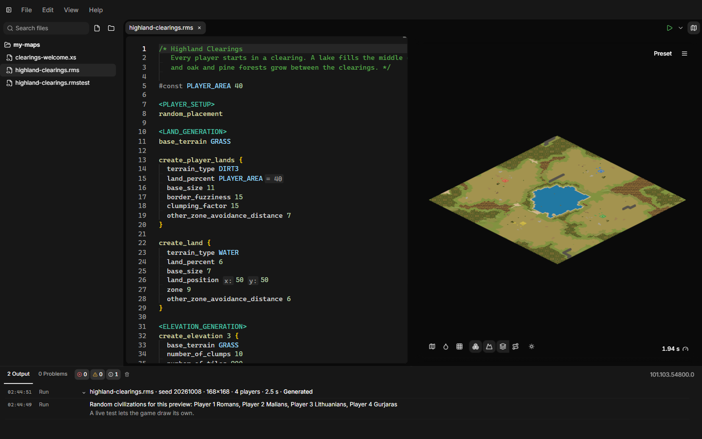

# AoE2RMSIDE

AoE2RMSIDE is a desktop editor for Age of Empires II: Definitive Edition
random map scripts (RMS). It is code-first: you write the script, and the
preview shows the result. Press **Run** and the map appears next to the code.
The IDE has its own RMS engine, so you do not need to start the game to see a
result.

## What you can do with it

- **Write scripts** with error checking, lint warnings with quick fixes,
  completion, hover documentation, inlay hints and formatting, for RMS and
  for the XS scripts your maps load. See [Writing scripts](writing-scripts.md).
- **Preview the map** for any seed, map size, player count, game setting and
  lobby option, in minimap colors or texture colors. See
  [Preview](preview.md).
- **Test many seeds at once.** A map test generates dozens or hundreds of maps
  and checks each one for problems you describe, such as missing gold or
  players without a land path. See [Map tests](map-tests.md).
- **Put the map into the game** as a local mod, optionally with a generated
  map icon with trees, gold, stone and player starts. See
  [Deploying and live testing](deploying-and-live-testing.md).
- **Test in the running game** (optional) through AoE2Control.
- **Use it in your language.** Menus, dialogs and messages are available in
  20 languages. See
  [Interface language](getting-started.md#interface-language).

## Requirements

- Windows 10 or Windows 11, 64-bit.
- Age of Empires II: Definitive Edition is **optional**.

Without the game you can write scripts, preview maps and run map tests. The
IDE ships the definitions it needs for each supported game version.

If the game is installed, AoE2RMSIDE can link its folder. A linked game adds:

- your own game version as the preview version;
- the game's standard include files, if your script uses them;
- the game's XS constants, so the editor can check your XS scripts fully;
- browsing and cloning the maps installed with the game;
- deploying your map as a local mod;
- live testing of your map in the running game (with AoE2Control).

The **Minimap colors** and **Texture colors** looks of the preview work
without the game.

Steam installations are found automatically. Installations from the Xbox app
or the Microsoft Store can be linked by selecting their game folder; they are
untested.

## Download and updates

Download AoE2RMSIDE from the
[AoE2RMSIDE releases page](https://github.com/aoe2control/AoE2RMSIDE/releases).
Each release has an installer and a portable ZIP.

The app is not code-signed, so Windows SmartScreen may warn you the first time
you start it.

AoE2RMSIDE does not update itself. When a newer release is available, it
shows a short note with a link in the Output panel when it starts. Download
the new version from the releases page yourself.

## Learn random map scripting

These pages explain AoE2RMSIDE, not the RMS language itself. To learn the
language, start with the
[Definitive Random Map Scripting Guide](https://forums.ageofempires.com/t/definitive-random-map-scripting-guide/104902)
by **Zetnus**, the most complete guide to random map scripts. Much of what
AoE2RMSIDE knows about random map scripts was learned from it. More guides,
including XS, are listed under
[Learn more](writing-scripts.md#learn-more).

## AoE2RMSIDE and AoE2Control

AoE2RMSIDE is a separate app from AoE2Control, made by the same maintainer.
Its documentation lives here, next to the AoE2Control documentation.

You only need AoE2Control for live testing. Editing, preview, map tests and
deployment work without it. AoE2RMSIDE does not include AoE2Control; you
install it separately if you want live tests.

AoE2RMSIDE is an independent project. Read
[RMS replication and compatibility boundary](faq.md#rms-replication-and-compatibility-boundary)
for what that means for compatibility with the game.
