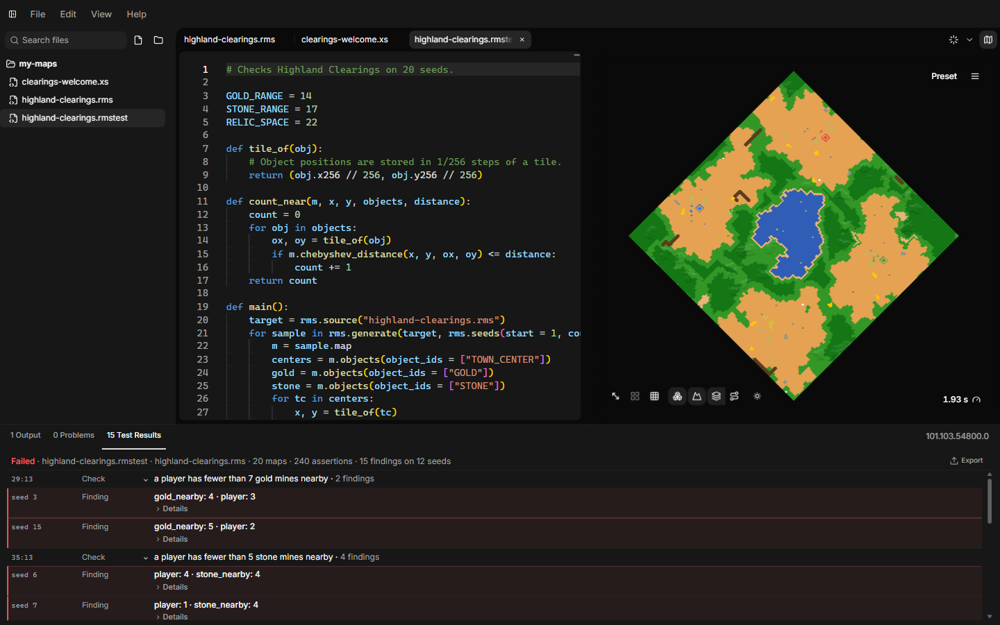

# Map tests

A random map looks different on every seed. A map can be fine on the ten
seeds you tried and still leave a player without gold on the eleventh.

A **map test** checks this for you. It generates your map for many seeds, one
after another, and runs your checks on every result. At the end you get a
list of the seeds where something was wrong. Click one and the preview shows
that same map.

Map tests run entirely inside AoE2RMSIDE. The game is not needed.

You do not need to be a programmer to write one. Map tests are small scripts
in a simple language, and most tests follow the same pattern. This page shows
that pattern step by step.

## Your first map test

### Create the file

Map tests are files with the extension `.rmstest`. To create one:

- right-click a folder in the Explorer and choose **Map-Test Script**, or
- use the **+** button next to a folder and choose **Map-Test Script**, or
- choose **File → New Map-Test Script**.

The new file contains a commented example. Lines starting with `#` are
comments, so the example does nothing until you remove the `#` signs.

### Write the test

Replace the content with this test. It generates your map for ten seeds and
checks that each map has at least eight gold mines:

```python
def main():
    target = rms.source()
    seeds = rms.seeds(start = 1, count = 10)

    for sample in rms.generate(target, seeds):
        gold = sample.map.objects(object_ids = ["GOLD"])
        sample.expect(
            len(gold) >= 8,
            message = "expected at least 8 gold mines",
            values = {"gold": len(gold)},
        )

main()
```

Line by line:

- `def main():` starts a block of code named `main`. Everything that belongs
  to it is indented by four spaces.
- `rms.source()` picks the map to test. Without a file name it uses the
  pinned map (see [below](#choose-the-map)).
- `rms.seeds(start = 1, count = 10)` makes the seeds 1, 2, 3 … 10.
- `rms.generate(...)` generates one map per seed. The `for` line then goes
  through the results one by one. Each result is called a **sample**.
- `sample.map.objects(object_ids = ["GOLD"])` returns every gold mine on that
  map. `GOLD` is the same name your RMS script uses.
- `sample.expect(...)` is the check. If the condition is false, it records a
  **finding** for this seed with your message and values.
- `main()` on the last line runs everything.

### Pin the map and run

1. Open the map you want to test and make its tab active.
2. In the Run options (the arrow next to the Run button), press
   **Pin executed script**.
3. Switch to your `.rmstest` tab and press **Run** (or F5).

The preview updates as maps are generated. While the test runs, a progress
bar on the right side of the bottom panel bar shows **Testing**. Point at it
to see how many maps are done, for example "Testing maps, 30% (12 of 40
maps)". The total counts the maps the test has asked for so far, so it grows
when a later `rms.generate` asks for more. When the test ends, Output shows
the test as one line with its result (**Passed** or **Failed**), and a
**Test Results** tab opens in the bottom panel (see
[Read the results](#read-the-results)).



## The language in two minutes

Map tests use **Starlark**, a small language that looks like Python. If you
know some Python, you already know most of it. If not, these rules cover
nearly everything on this page:

- Indentation matters. Lines inside `def`, `for` and `if` are indented by
  four spaces.
- `#` starts a comment.
- Put your loops and `if` statements inside a function such as `main`, and
  call `main()` at the end. Starlark does not allow them at the top level of
  the file.
- Top-level constants are fine, for example `LIMIT = 20`.
- Lists are written `["GOLD", "STONE"]`. Text is written in quotes,
  `"like this"`.
- Compare values with `==` (equal), `!=` (not equal), `<`, `<=`, `>` and
  `>=`. Combine conditions with `and`, `or` and `not`. A comparison gives
  `True` or `False`.
- `len(x)` counts the items in a list. `min`, `max`, `range`, `sorted` and
  `abs` work as in Python.

A few Python features are not available: `import`, f-strings and `sum()`.
Use `print("gold:", count)` or `"gold: {}".format(count)` to build text.

The editor helps with map tests too: suggestions and documentation for the
`rms` functions, **Go to Definition** (F12) for your own functions and
names, **Go to Symbol** and **Format Document**. The right-click menu lists
only what works in map tests.

Map tests cannot read or write files, use the network or pick random numbers.
All variation comes from the seeds, so a test gives the same result every time
you run it.

## Names of terrains and objects

Wherever a map test asks for terrains, objects or cliff types, you can use
the same names as in your RMS script: `"GOLD"`, `"FORAGE"`, `"TOWN_CENTER"`,
`"DEEP_WATER"`, `"CT_DESERT"` and so on. Write them in quotes, exactly as in
RMS. The names come from the game version selected for the preview.

Numbers work too, and you can mix both: `["GOLD", 102]`. A name AoE2RMSIDE
does not know stops the test with a message that names it.

The results a map test gets back, such as `tile.terrain` or
`obj.object_id`, are numbers. To compare them with a name, use `rms.id`:

```python
def main():
    for sample in rms.generate(rms.source(), rms.seeds(start = 1, count = 20)):
        corner = sample.map.tile(0, 0)
        sample.expect(
            corner.terrain != rms.id("DEEP_WATER"),
            message = "the corner of the map is deep water",
        )

main()
```

## Choose the map

`rms.source()` without a file name uses the pinned map. If nothing is pinned,
the test stops and asks you to pin a map or name one.

You can also name the map. The path is relative to the open folder (or, for a
test opened on its own from outside the open folder, to the test's own
folder):

```python
def main():
    target = rms.source("maps/arena.rms")
    seeds = rms.seeds(start = 1000, count = 200)
    samples = rms.generate(target, seeds, preview = False)
    print("generated", len(samples), "maps")

main()
```

The map size, players, game mode and game version come from the preview's
current settings, the same ones an ordinary Run uses. See
[Preview](preview.md#map-settings).

## Run many seeds

`rms.seeds` makes a list of seeds:

| Call | Seeds |
|---|---|
| `rms.seeds(start = 1)` | 1 |
| `rms.seeds(start = 1, count = 100)` | 1, 2, 3 … 100 |
| `rms.seeds(start = 1000, count = 50, step = 7)` | 1000, 1007, 1014 … |

You can also write a list of seeds yourself, for example `[5, 17, 42]`.

`rms.generate(target, seeds)` shows each finished map in the preview. With
`preview = False` the preview stays as it is, which is useful for long runs.

AoE2RMSIDE generates several maps at the same time. By default
(**Automatic**) it decides how many from your computer's processor cores,
free memory and the map size, and leaves room for the editor. To use a fixed
number instead, open the Run options (the arrow next to the Run button)
while the map test is the active file, and enter it under **Test cores** (it
takes the place of *Live test on run*). Leave it empty for Automatic, or enter a
number from 1 to your computer's processor count (at most 32); **Use Automatic**
empties the field again. Point at **Test cores** to see the range for your
computer. Work that is the same for every seed is
done once per batch, not once per map. Whatever the number, the results
always come back in seed order and are the same.

## Check something about each map

There are two ways to record a problem:

- `sample.expect(condition, message = "...")` records a finding **only when
  the condition is false**.
- `sample.report(message = "...")` **always** records a finding. Use it
  inside your own `if`.

Both take two optional extras:

- `values = {...}`: numbers or short texts to show with the finding, for
  example `{"gold": 5}`.
- `code = "..."`: a short label you choose, for example `"no-gold"`, to group
  findings of the same kind.

The following examples show common checks.

### Count objects

`objects` returns the objects with the names you give. `owner` limits the
result to one player; `0` is Gaia (nature).

```python
def main():
    for sample in rms.generate(rms.source(), rms.seeds(start = 1, count = 50)):
        m = sample.map
        centers = m.objects(object_ids = ["TOWN_CENTER"])
        sample.expect(len(centers) == 2, message = "expected two Town Centers")

        resources = m.objects(object_ids = ["GOLD", "STONE"])
        print("seed", sample.seed, "has", len(resources), "gold and stone objects")

main()
```

### Count terrain

`count_tiles` counts the tiles with any of the given terrains. This test
reports maps where more than 40% of the map is water:

```python
WATER_TERRAINS = ["WATER", "DEEP_WATER", "MED_WATER"]

def main():
    for sample in rms.generate(rms.source(), rms.seeds(start = 1, count = 50)):
        m = sample.map
        water = m.count_tiles(terrain_ids = WATER_TERRAINS)
        percent = water * 100 // (m.width * m.height)
        sample.expect(
            percent <= 40,
            message = "more than 40% of the map is water",
            values = {"water_percent": percent},
        )

main()
```

`//` divides and drops the remainder, so `percent` is a whole number.

### Measure distances

Objects store their position in 1/256 of a tile. Divide by 256 to get the
tile. This test checks that every Town Center has gold within 20 tiles:

```python
def tile_of(obj):
    # Object positions are stored in 1/256 steps of a tile.
    return (obj.x256 // 256, obj.y256 // 256)

def main():
    for sample in rms.generate(rms.source(), rms.seeds(start = 1, count = 50)):
        m = sample.map
        gold = m.objects(object_ids = ["GOLD"])
        for tc in m.objects(object_ids = ["TOWN_CENTER"]):
            tx, ty = tile_of(tc)
            nearest = None
            for mine in gold:
                gx, gy = tile_of(mine)
                d = m.chebyshev_distance(tx, ty, gx, gy)
                if nearest == None or d < nearest:
                    nearest = d
            sample.expect(
                nearest != None and nearest <= 20,
                message = "a player has no gold within 20 tiles",
                values = {"player": tc.owner, "nearest": nearest},
            )

main()
```

`chebyshev_distance` counts tiles like a king moves in chess: diagonal steps
count as one. `manhattan_distance` counts only straight steps, and
`squared_distance` gives the straight-line distance squared.

### Check that players are connected

`connected` tells you whether you can walk from one tile to another using
only the terrains you list. This test checks that every player can reach the
first player over land:

```python
WALKABLE = ["GRASS", "BEACH", "SHALLOW", "DIRT"]

def main():
    for sample in rms.generate(rms.source(), rms.seeds(start = 1, count = 50)):
        m = sample.map
        centers = m.objects(object_ids = ["TOWN_CENTER"])
        for other in centers[1:]:
            first = centers[0]
            linked = m.connected(
                first.x256 // 256, first.y256 // 256,
                other.x256 // 256, other.y256 // 256,
                terrain_ids = WALKABLE,
            )
            sample.expect(
                linked,
                message = "two players are not connected by land",
                values = {"player_a": first.owner, "player_b": other.owner},
            )

main()
```

List every walkable terrain your map uses. `connected` only looks at terrain.
It moves in straight steps (up, down, left, right) and ignores objects.

### Find separate areas

`components` splits the tiles with the given terrains into separate connected
areas, for example lakes or islands. Each area is a list of tiles:

```python
WATER_TERRAINS = ["WATER", "DEEP_WATER", "MED_WATER"]

def main():
    for sample in rms.generate(rms.source(), rms.seeds(start = 7)):
        m = sample.map
        lakes = m.components(terrain_ids = WATER_TERRAINS)
        print("seed", sample.seed, "has", len(lakes), "separate bodies of water")
        biggest = 0
        for lake in lakes:
            biggest = max(biggest, len(lake))
        print("largest one:", biggest, "tiles")
        for warning in sample.warnings:
            print("warning:", warning.code, warning.message)

main()
```

## Summaries and averages

Not every test needs findings. `print` writes to Output, so you can collect
numbers across all seeds and print a summary at the end:

```python
def main():
    seeds = rms.seeds(start = 1, count = 100)
    total = 0
    fewest = None
    for sample in rms.generate(rms.source(), seeds, preview = False):
        count = len(sample.map.objects(object_ids = ["GOLD"]))
        total += count
        if fewest == None or count < fewest:
            fewest = count
        if count == 0:
            sample.report(message = "this map has no gold at all", code = "no-gold")
    print("average gold mines per map:", total / len(seeds))
    print("fewest gold mines on one map:", fewest)

main()
```

## Read the results

When the test ends, the **Test Results** tab opens. The number on the tab is
the number of findings. The first line is a summary such as
`Failed · gold.rmstest · Arena.rms · 50 maps · 100 assertions · 3 findings on 2 seeds`:

- the result: **Passed** when the test ran to the end and recorded no
  finding, **Failed** when it recorded at least one;
- the test and, when every finding is on the same map, that map;
- **maps**: how many maps were generated;
- **assertions**: how many times `expect` or `report` was called;
- **findings**: how many problems were recorded, and on how many seeds.

Below the summary, findings are grouped by the check that recorded them: one
group per `expect` or `report` line of your test, in the order of your test.
A group shows the check's message and how many findings it has. If the
message is different for each finding (for example because it contains the
seed), the group is called "Check on line 12" and each finding shows its own
message.

Each finding shows its seed and the values you recorded with it, for example
`seed 17 · player: 1 · gold_nearby: 4`. **Details** under a finding shows your
`code`, the line of your test, the map file and the values in full. When the
same finding is recorded several times on one seed (for example once per
player), it is shown once with a count such as `×2`.

- **Click a finding** (or its seed) to generate that same map in the preview.
  This works as long as the test script is open and neither the test, the
  map nor the game version has changed since the run. If it cannot, Output
  says why.
- **Click the line number** in front of a check (such as `21:13`) to go to
  that line of your test.
- Click the arrow before a check to collapse or expand it. A check with many
  findings shows the first 100; **Show 100 more** shows the next ones.

If the test stops early, it records no new results. This happens when the
test script has a mistake, a map fails to generate, a limit is reached, or you
press Stop. Problems shows the line of your test where it stopped, and Output
explains what happened. If the Test Results tab was already open, it keeps the
results of the run before and says so at the top ("The latest run stopped with
an error" or "The latest run was stopped"). While a new run is going, it says
"A map test is running", with the maps tested so far once the test has asked
for maps, for example "A map test is running · 12 of 40 maps".

Use `print` freely while you write a test. Everything printed appears under
the test's line in Output, in a monospace font, in the order your test printed
it. Output keeps the latest 200 lines of each run and says how many earlier
lines it no longer shows.

### Save and share a report

**Export** in the Test Results tab saves the results as a JSON file. The
report contains no script text, no generated maps and no full file paths.

**File → Import Test Report…** opens a saved report, for example one a friend
sent you. The menu item is only there while no Test Results tab is open. An
imported report says so at the top. To show a finding's map from it, open the
same test with the same map and game version.

The Test Results tab closes when you start an ordinary map Run.

## Limits

Map tests have fixed limits so a test cannot freeze your computer:

| Limit | Value |
|---|---|
| Maps per run | 4,096 |
| Findings per run | 4,096 |
| Values per finding | 32 |
| Run time | 10 minutes |
| Output | 10,000 lines |
| Test script size | 1 MiB |

The memory a test may use depends on your computer, up to a fixed maximum.
Large batches of the largest maps can still reach it. The test then
stops and asks you to generate fewer seeds per run.

The script itself also has a step limit. Looping over every tile of every
map in your own code can reach it. Prefer the built-in functions such as
`count_tiles`, `components` and `connected`, which do that work much faster.

## Function reference

### `rms`

| Function | Returns |
|---|---|
| `rms.source()` | The pinned map. |
| `rms.source("path/map.rms")` | The named `.rms` or `.rms2` file, relative to the open folder (or the test's own folder when the test is outside it). |
| `rms.seeds(start, count = 1, step = 1)` | A list of seeds. |
| `rms.generate(target, seeds, preview = True)` | One sample per seed, in seed order. |
| `rms.id("NAME")` | The number behind a game constant name, such as `rms.id("GOLD")`. |

Also available: `print(...)`, which writes to Output, and `fail("message")`,
which stops the test with an error.

### Sample

| Name | What it is |
|---|---|
| `sample.seed` | The seed of this map. |
| `sample.map` | The generated map. |
| `sample.expect(condition, message, values = None, code = None)` | Records a finding if `condition` is false. |
| `sample.report(message, values = None, code = None)` | Always records a finding. |
| `sample.warnings` | Warnings from generating this map; each has `code` and `message`. |
| `sample.metrics` | `tile_count`, `object_count` and other counts for this map. |
| `sample.map_hash`, `sample.request_hash` | Fingerprints that identify this map and request. |

### Map

Tile coordinates start at `0`. `x` runs from `0` to `width - 1`, `y` from `0`
to `height - 1`.

| Function | Returns |
|---|---|
| `map.width`, `map.height` | Map size in tiles. |
| `map.tile(x, y)` | One tile. |
| `map.tiles(...)` | The tiles that match the filters. |
| `map.count_tiles(...)` | How many tiles match the filters. |
| `map.objects(object_ids = None, owner = None)` | Objects, optionally only these objects or this owner. Includes walls. |
| `map.walls(object_ids = None, owner = None)` | Only wall objects. |
| `map.neighbors(x, y, diagonal = False)` | The 4 (or 8) tiles around a tile. |
| `map.connected(x1, y1, x2, y2, ...)` | `True` if the two tiles are linked through tiles that match the filters. |
| `map.components(...)` | Separate connected areas of matching tiles, each a list of tiles. |
| `map.boundaries(...)` | Matching tiles at the edge of their area or of the map. |
| `map.manhattan_distance(x1, y1, x2, y2)` | Straight steps between two tiles. |
| `map.chebyshev_distance(x1, y1, x2, y2)` | Steps between two tiles when diagonal steps count as one. |
| `map.squared_distance(x1, y1, x2, y2)` | Straight-line distance, squared. |
| `map.cliffs(cliff_types = None)` | Cliff pieces, each with `from_x`, `from_y`, `to_x`, `to_y` and `cliff_type`. |
| `map.connections(kinds = None)` | Connections, each with `start_x`, `start_y`, `end_x`, `end_y` and `kind` (`"land"`, `"water"` or `"road"`). |

Where a function takes `...`, you can filter by `terrain_ids`,
`land_zone_ids`, `terrain_zone_ids` and `layer_ids`. Each filter is a list. A
tile matches if it matches every filter you give.

`object_ids`, `terrain_ids` and `cliff_types` accept names and numbers.
`land_zone_ids`, `terrain_zone_ids`, `layer_ids` and `owner` take numbers.

### Tile and object fields

| Record | Fields |
|---|---|
| Tile | `x`, `y`, `terrain`, `elevation`; advanced: `land_zone`, `terrain_zone`, `layer`, `flags` |
| Object | `object_id`, `owner`, `x256`, `y256`, `is_wall`; advanced: `facet`, `footprint_width256`, `footprint_height256`, `resource_type`, `resource_delta`, `resource_quantity_f32_bits`, `status`, `death_state`, `data_status`, `selection_flags`, `behavior_flags` |

All fields are numbers, except `is_wall` (`True` or `False`). `x256` and
`y256` are positions in 1/256 of a tile. The advanced fields are low-level
values the game stores for each tile and object; most tests do not need them.

The editor completes these names and shows a short description when you
point at them.
