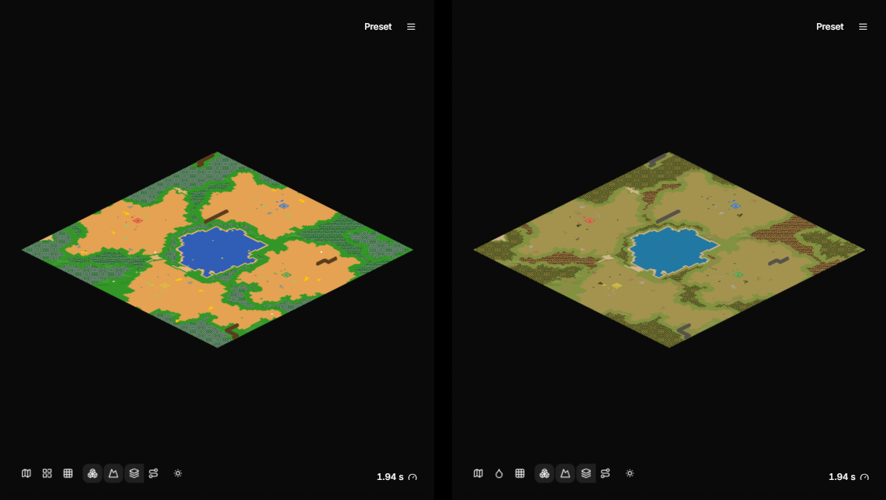
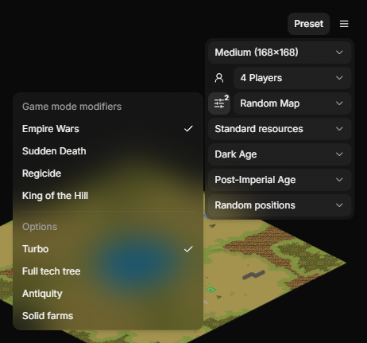
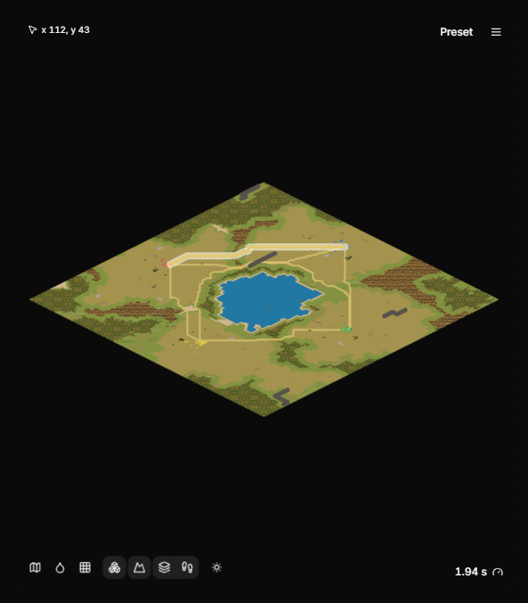
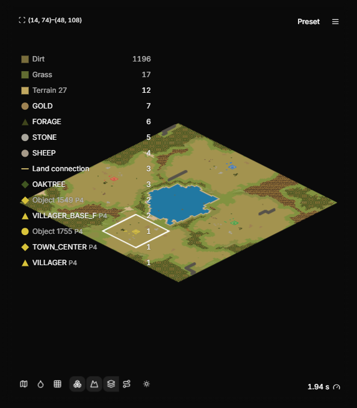
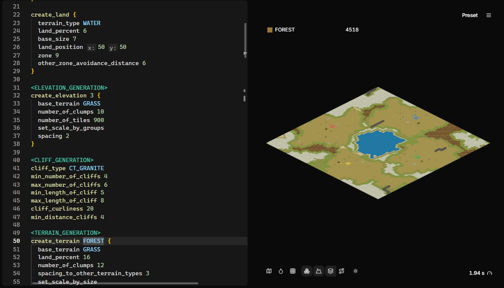

# Preview

When you press **Run**, AoE2RMSIDE generates the map from your script and
shows it in the preview on the right. The map is generated by AoE2RMSIDE's own
RMS engine. The game does not need to be installed or running.

The preview shows the map as it is when a game starts: terrain, elevation,
cliffs, objects and player starting positions.

## Perspective and look

The map tools at the bottom left of the preview start with three buttons that
decide how the map is drawn: **Perspective**, **Look** and **Tile grid**.
AoE2RMSIDE remembers all three, also after a restart.

**Perspective** switches between two views:

- **Top-down view** looks straight down on the map.
- **Diamond view** is flatter, like the game's own view and minimap.

**Look** moves to the next look each time you click it. Its tooltip names the
current look.

- **Minimap colors** draws every terrain in the color the game's own minimap
  uses, and objects as small markers. The game gives many terrains the same
  minimap color: for example, dry grass and snow use the same green as grass,
  and every forest uses the same dark green.
- **Texture colors** draws every terrain in the average color of its game
  texture, and trees, gold, stone and other nature objects in the average
  color of their graphic. Player objects keep their player color. The colors
  ship with AoE2RMSIDE, so this look works without the game.

Some things look different in each look:

- **Cliffs** are wide dark brown bands in Minimap colors, so they stand out
  on every terrain, and bands in the average color of their rock in Texture
  colors.
- **Forests** show every tree. Each tree is a small marker, so the ground
  color shows between the trees when you zoom out.
- In **Diamond view**, object markers are squeezed to the flat diamond shape
  of the tiles.

**Tile grid** draws a thin dark line along every tile edge, in every look and
both perspectives. It is off by default. The lines are hidden while you are
zoomed far out and fade in as you zoom closer, so the grid never covers the
map.

Perspective, look and tile grid only change the picture on screen. They never
change the generated map, map tests or the map files you deploy. The map icon
has its own perspective and look buttons; see
[Map icons](deploying-and-live-testing.md#map-icons).

## Game version

The **Preview game version** menu sits on the right side of the bottom panel
bar. It decides which version of the game the map is generated for.

- **Your local version.** With a linked game folder, the first entry is your
  installed game version, for example `101.103.48987.0 (local)`. This is the
  default while a game folder is linked.
- **Versions shipped with AoE2RMSIDE.** Below it are the game versions the IDE
  ships definitions for. They work without the game.
- **Select game folder.** Without a linked folder, the first entry links one.

A local version that AoE2RMSIDE has not verified, such as a game update that
came out after your AoE2RMSIDE release, still works. It is labeled
`(not verified)` and uses the rules of the newest verified version with the
object and terrain definitions from your own installation. The Output line of
each run then adds `unverified game version` after the result. See
[Compatibility, limits and troubleshooting](faq.md#game-versions-and-compatibility).

If you pick a shipped version while a game folder is linked, that choice only
lasts while the same folder and game version stay linked. After a game update
or a different folder, the preview goes back to the local version.

## Map settings

The **preset menu** at the top of the preview holds the lobby settings the map
is generated with:

- **Map size:** Tiny (120×120) up to Ludicrous (480×480). Medium is the
  default.
- **Player count:** 1 to 8 players.
- **Configure players:** each player's color, civilization, team, and whether
  the player is a computer player (this defines `AI_PLAYERS` for your script).
  The civilization list follows the preview game version: Saxons, Varangians
  and Danes appear only for 101.103.54800.0. If you switch to a
  version without your chosen civilization, that player previews as Random.
- **Game mode**, **Starting resources**, **Starting age**, **Ending age** and
  **Position policy** (random positions, fixed positions or team together).
- **Lobby options** (the sliders button before the game mode): the game mode
  modifiers **Empire Wars**, **Sudden Death**, **Regicide** and **King of the
  Hill**, which the game adds on top of the game mode, and **Turbo**, **Full
  tech tree**, **Antiquity** and **Solid farms**. All are off by default.
  Each one defines the label your script can test with `if`: `EMPIRE_WARS`,
  `SUDDEN_DEATH`, `REGICIDE`, `KING_OT_HILL`, `TURBO_MODE` (and
  `TURBO_RANDOM_MAP` on Random Map), `FULL_TECH_TREE`, `ANTIQUITY_MODE` and
  `SOLID_FARMS`. The modifier that is already the game mode is greyed out and
  marked **(game mode)**. The button shows how many options are on. Point at
  an option for a short explanation.

!!! note "Turbo Random Map"
    **Turbo Random Map** is the game's old mode and stays in the list as it
    was. For the game's turbo labels, choose **Random Map** and turn on
    **Turbo**; when Turbo Random Map is selected, the preset menu offers
    **Use Random Map + Turbo** to switch.

!!! note "Regicide without kings"
    With the Regicide modifier on, the game ends the match at once on a map
    that places no king for every player. The lobby options panel says so
    while Regicide is on. The preview still shows the map.

Some scripts replace objects depending on researched technologies. With
**Full tech tree** or **Antiquity** on, such a script cannot be previewed;
Output says so and suggests turning those options off.

**Computer players and live tests.** In the preview, any player can be a
human or a computer player. A live test always starts a single-player game,
where you play P1 and every other player is a computer. While **Live test on
run** is on, the players menu shows every player after P1 as a computer (the
switch is locked, and its tooltip says "Live tests make every player after P1
a computer") and the preview uses that lobby too, so the preview and the live
match agree. If no player sits in P1, the players menu asks you to put one
there. Your own choice comes back when you turn live testing off.

You can save combinations as named presets and switch between them.

If a player sits in a slot your script gives no land, the map is still
generated, as in the game: that player starts without a land and gets none
of the per-player objects. Output warns, names the slot and, when it can,
says which player to put back where (for example
**Put player 2 back in slot P2**).

## Seed

The seed decides every random choice in the map. The same script, settings,
game version and seed always give the same map.

Open the Run options (the arrow next to the Run button) to set it:

- **Seed:** a whole number from 0 to 4294967295.
- The button next to the Seed field switches between **Randomize on run**
  (a dice) and **Locked** (a lock). **Randomize on run** is the default for a
  new setup and picks a new seed each time you press Run. **Locked** keeps
  the seed until you change it. Saved presets keep your chosen mode. To
  reproduce a map later, copy its seed and lock it.

## Running automatically

Two buttons sit side by side at the top of the Run options:

- **Run on save:** runs when you save the script that Run would execute.
- **Run on edit:** runs shortly after you stop typing.

Click a button to turn it on or off. Both are off by default. Like every
on/off button in AoE2RMSIDE, a button that is on has a stronger fill than
one that is off, and pointing at a button makes its fill a step stronger.
These two show their state by the fill alone; wider buttons such as
**Live test on run** also show a check mark while they are on.

Run on edit, and reruns after a settings change, only start once you have
pressed Run in the current session.

Run on edit, run on save, and changes to the map size, seed, players, lobby
settings or game version rerun the preview automatically. This only happens
while the file being run is a map script (`.rms` or `.rms2`) that Run can run.
While an include file (`.inc`, `.def`, `.xs`), a map test, an empty script, or a
selection Run can't use is active, automatic runs are skipped silently: nothing
is reported and the preview keeps its last map. Map tests run with Run, or with
Run on save.

## Moving around the map

| Action | Mouse | Keyboard |
|---|---|---|
| Zoom | Mouse wheel | `+` and `-` |
| Pan | Drag with the right mouse button | Ctrl+arrow keys |
| Fit the whole map | | `0` or Home |
| Select one tile | Click | Arrow keys |
| Select an area | Drag with the left mouse button | Shift+arrow keys |
| Select the whole map | | Ctrl+A |
| Clear the selection | Click outside the map | Esc |

The coordinates of the tile under the pointer and of the selection are shown
in the top-left corner of the preview.

At the closest zoom a tile is always the same size on screen, on every map
size, in both perspectives and however large the preview is, so even on the
largest maps you can look at single tiles closely.

When you reach the map with Tab or F6, **Arrow keys select tiles** appears
next to the toolbar buttons to show that the map has keyboard focus.

After [Perspective, Look and Tile grid](#perspective-and-look), the map tools
switch what is drawn:

- **Objects and Town Center footprint**;
- **Cliff edges**;
- **Connection terrain changes** and the connection button (only for maps
  with connections, see [Connections](#connections));
- elevation: **Elevation off**, **Terrain relief** (the default) or
  **Height map**.

### Connections

The connection button cycles through three states each time you click it:

1. **Connection lines off**: no connections are drawn.
2. **Connection lines**: a straight line between the two ends of every
   connection.
3. **Traced connection paths**: for every connection search, the path of
   tiles the map generator went through, in the same color as its
   straight line, with a small dot at its start and its end. Paths that share
   tiles draw over each other, so busy stretches look darker. A search that
   found no path is a thin dashed gray line between the two areas it tried to
   connect.

Point at a line or a path to highlight it, and click it to open the
`create_connect_...` command that made it, as you would from the selection
list. While traced paths are shown, selecting a tile also lists every path
that crosses it, so you can reach the command with the keyboard too.

The map generator keeps the paths of its first 2,048 searches. On maps with
more connections the button's tooltip says how many are shown, for example
**2,048 of 3,100 paths shown**; the other connections are still on the map.

Traced paths belong to the finished map. While a map is still being generated
the button skips them and its tooltip says **Traced paths show once the map is
finished**. Maps shown from a map test have no traced paths.

**View → Show Live Generation Stages** is on by default. The preview then
updates while the map is being generated, stage by stage. Turn it off to see
only the finished map.

## What is on a tile: the selection list

Select one tile or an area. A list in the top-left corner of the preview shows
everything in the selection: terrains, objects and walls, each with a count.
With a linked game folder, the rows use the game's own names, such as
**Gold Mine**. Without one, they use the names your script uses, such as
`GOLD` or `FOREST`; something that has no such name is listed by its number.

- Click a row to open the script line that created it. This also works for
  lines in include files.
- Point at the list (or at the coordinates above it) to show the **Filter**
  box at the top of the list. While you point there, the list also gets a
  faint background so it is easier to read over the map. Type in the box to
  show only the rows whose name contains what you type, for example `gold` or
  `p2`. Upper and lower case do not matter, and `_` matches a space, so
  `gold` finds both `GOLD` and **Gold Mine**. It filters the list only; the selection on the map stays the same.
  The text stays when you select something else, even after clearing the
  selection, until you press Esc in the box or click its **x**. While it
  holds text, the box stays visible.
- The list keeps the same width whatever it shows, so it never jumps while
  you select or filter.
- Helper objects are hidden by default. Use the
  **Show helper objects** button at the bottom of the list to include them.
- Trees that a forest terrain places are listed like every other object.
  Small decorations such as grass and flowers are not listed.

## From code to map: highlighting

Move the mouse pointer into the editor and place the cursor on a line, or
select several lines. The preview highlights the tiles and objects that code
created, and the selection list shows only those.

- A line inside a block such as `create_land { ... }` or
  `create_object { ... }` highlights everything the whole block created.
- An `if` or `endif` line highlights what the whole condition created; an
  `elseif` or `else` line highlights only that branch.
- A section header such as `<OBJECTS_GENERATION>` highlights what its whole
  section created.
- With an area selected on the map, the highlight stays inside that area.
- A line that created nothing on this seed highlights nothing.

Move the pointer out of the editor to see the whole map again. Highlighting
is paused while a run is in progress.

## Execution cost

The gauge button in the preview shows how long the last run took. Click it to
open a breakdown by generation step: script parsing, player setup, land,
elevation, cliffs, terrain, connections, object placement and the final steps.
Point at a row to see counters for that step.

While the preview is collapsed, the gauge button sits on the right side of the
bottom panel bar and shows the run's time without a progress bar. Click it to
expand the preview with the breakdown open.

Use it to find the expensive part of a slow script. The numbers are measured
on your computer for one run. They are not a prediction of how long the game
takes to generate the map.

## When a run fails

A short notice appears at the bottom right of the editor with what happened
and what to do, in the same words as the run's line in Output, which also has
the technical **Details**. The notice stays long enough to read (4 to 10
seconds, longer for a longer message), and stays while you point at it or
while it has keyboard focus.

- If the script has errors, the preview keeps the last good map.
- If generation itself fails, the preview is cleared.

For common messages, see
[Compatibility, limits and troubleshooting](faq.md#common-problems).
