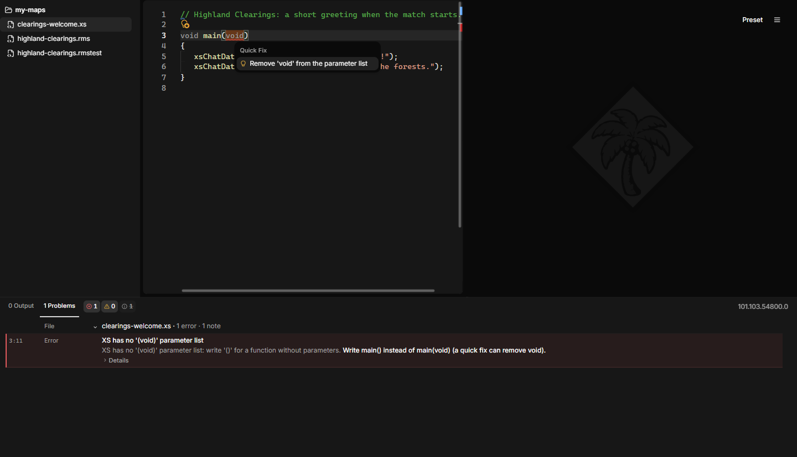
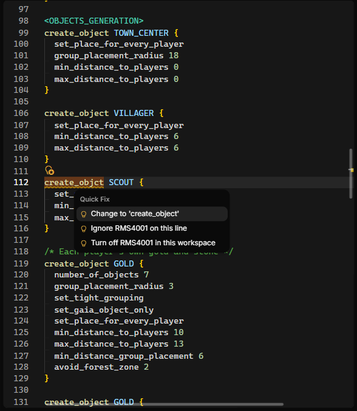
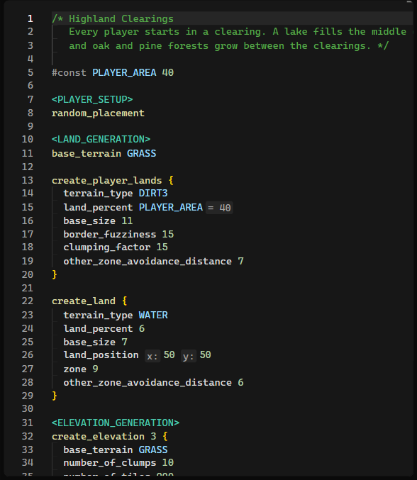

# Writing scripts

This page covers the files AoE2RMSIDE works with, how includes are found, and
the help the editor gives you. It does not teach the RMS language itself. For
that, see [Learn more](#learn-more) at the end of this page.

## File types

| Extension | What it is | Can you Run it? |
|---|---|---|
| `.rms`, `.rms2` | A random map script. This is the map the game lists. | Yes |
| `.inc`, `.def` | An include file with shared code, used by a map through `#include`. | No, run the map that includes it |
| `.xs` | An XS script, loaded by a map with `#includeXS`. | No, run the map that loads it |
| `.rmstest` | A map test for AoE2RMSIDE. See [Map tests](map-tests.md). | Yes |

If you press Run with an `.inc`, `.def` or `.xs` file active and no map
pinned, Output says that these files are include-only and cannot be run.

### Running a map while you edit an include

An include file cannot run on its own. To see its effect, pin the map that
uses it:

1. Open the map (`.rms` or `.rms2`) so its tab is active.
2. Open the Run options (the arrow next to the Run button).
3. Press **Pin executed script**. The map's tab now shows a small play icon.
4. Switch to your include file and edit it. **Run** now runs the pinned map.

The **Executed script** field in the same menu always shows which script Run
will use.

## XS scripts

A map can load an XS script with `#includeXS filename.xs`. Keep the `.xs` file
in your open folder (or use one of the game's own XS files). AoE2RMSIDE finds
it there. When you deploy the map, the XS file goes into the mod; when you
start a live test, it is also copied into your game profile's XS folder (see
[Live testing](deploying-and-live-testing.md#xs-files-in-live-tests)).

To start a new XS file, right-click a folder in the Explorer and choose
**XS Script** (below **Map-Test Script**), or use **File → New XS Script**.
The new file has a short commented `main()` function, which the game runs
once when the match starts.

What the editor does for `.xs` files:

- Syntax coloring that matches your RMS theme, folding and an outline.
  **Ctrl+/** toggles `//` comments and **Shift+Alt+A** toggles `/* */`
  comments.
- Checks as you type, listed in **Problems** like RMS problems: syntax
  errors, undefined or misspelled names, wrong types and argument counts,
  functions that are not available in the selected game version or cannot
  be used from a random map, unknown rule names, unreachable code, unused
  variables, and more.
- Completion, signature help, and hover documentation from a built-in catalog
  of XS functions. It offers only what the selected game version has.
  Completion opens by itself after a `.` and on **Ctrl+Space**. Choosing a
  function inserts the call with its parentheses, puts the cursor between
  them and opens the parameter help. If the parentheses are already there,
  only the name changes.
- Parameter help while you type a call: a small box shows the function's
  parameters with their names, types and default values, and marks the one
  you are typing. For some functions, the box and the hover also explain in
  plain words what each parameter does and what the function returns, with a
  link to the [AoE2DE UGC Guide](#xs-scripting).
- The name of each parameter before its argument, in calls that pass two or
  more arguments (see [Inlay hints](#inlay-hints)). An argument that is
  already a variable with the parameter's name gets no hint.
- A hint when two arguments look swapped. Say a function's parameters are
  named `columns` and `rows`, and you call it with your own variables `rows`
  and `columns` in that order: each variable sits in the place of the
  parameter with the other's name. A small dotted mark then appears under
  the two arguments; point at it to read **Check the argument order**
  (XS4027). The order may be what you want, so this is only a hint: it is not
  listed in Problems and has no quick fix.
- Links to related places. When a problem is about another place too, such
  as the earlier definition a duplicate name repeats, the declaration a name
  is used before, or the function whose arguments look swapped, the message
  links to that place in the hover and in the **Alt+F8** peek. Click the link
  to go there.
- Quick fixes (**Ctrl+.**, or the light bulb) where the fix is clear:
    - remove an unused variable or a self-assignment;
    - insert a missing `;` at the end of a line;
    - replace a function the selected game version knows under another name,
      for example **Use 'xsUnsyncGetLocalPlayerId'**;
    - turn `main(void)` into `main()`. XS has no `(void)` parameter list, and
      the game refuses the file as the editor does.
- **Rename** (**F2**) of your own functions, rules, and variables across the
  XS files of a map. Every file that uses the name must be open in the
  editor; otherwise the rename box names the file to open first. Names from
  the game's own `Constants.xs` and the game's own files are never renamed.
- **Go to Definition** (**F12**) works from an `#includeXS` line into the XS
  file, from an `include "file.xs";` line, between XS files, to your own XS
  functions, and to the game's constants. Include lines also open their file
  from the hover, with Ctrl+click, or with **Open Included File** in the
  right-click menu (see [Opening included files](#opening-included-files)).
  **Find All References** (**Shift+F12**) lists where a name is used.
- **Format Document** (**Shift+Alt+F**) changes only the indentation and the
  spaces at the ends of lines. **Format on Save** formats XS files too. A file
  with syntax errors is not formatted.
- Deploying and live testing refuse a map whose XS file has syntax errors,
  for example **start.xs has XS syntax errors**, with the file and line. A
  live test checks this before it changes anything in the game, and nothing
  is deployed.

Link your game folder so the editor can read the game's XS constants (from
the game's own `Constants.xs`, which AoE2RMSIDE never copies). Without it,
the editor cannot tell a misspelled constant from a real one. A note in
Problems says so; notes are hidden until you turn them on in the Problems
filter.

The preview does not run XS. The game runs a map's XS code after the map has
been generated, so XS never changes the terrain or elevation you see; it can
change players, objects, and game data when the match starts. When a map
loads XS, the run's line in Output and Problems show the note **XS effects
are not shown**. It is information only and does not stop anything.



## Includes and the game's definitions

### Your own includes

`#include` loads another file into your script. AoE2RMSIDE looks for it in the
open folder. If a file cannot be found, it is skipped with a warning, as in
the game. The editor marks the line and Output explains the problem. To open
an included file, point at its name and click
**Open**, Ctrl+click it, or right-click the line and choose **Open Included
File** (see [Opening included files](#opening-included-files)).

Open the folder that contains your map and its includes with
**File → Open Folder…**. Opening a single file also works: its includes are
still found next to it, and you can open the files it includes from their
include lines, but the Explorer does not show that file's folder.

### Built-in names such as GOLD or GRASS

Names like `GOLD`, `GRASS` or `TOWN_CENTER` come from the game's definitions.
AoE2RMSIDE ships these definitions for every game version it supports, so
they work without the game installed.

### The game's standard include files

The game comes with its own include files that official maps use. AoE2RMSIDE
does not ship them. A script that includes one of them needs:

- a linked game folder, and
- the local game version selected in the **Preview game version** menu.

Otherwise the script cannot run, and Output names the include and the one
step to take (**Link your game folder** or **Select your local game
version**). See
[Getting started](getting-started.md#link-your-game-folder-optional).

You cannot give your own files the name of one of the game's standard
include files. The IDE refuses such a name so your file cannot be confused
with the game's.

## Help in the editor

### Errors and warnings

The editor checks your script while you type. Problems are underlined in the
text and listed in the **Problems** tab. Point at an underlined word to read
the message. **Alt+F8** shows the message of the next problem right under its
line. When a problem is about another place too, for example the line that
sets an attribute again or the first definition of a name, the message links
to it in both views; click the link to go there.

Some problems only appear when you run the map. They are reported in
**Output** under the run's line, with the script and line when there is one.
Output shows a plain headline, one sentence of cause and at most one step to
take; the code and the full technical message are under **Details** for bug
reports. Problems you can see in the editor stay in **Problems** and are not
repeated in Output.

### Lint warnings

Besides errors, the editor warns about code that is valid but probably not
what you meant. Each of these lint rules has a code:

| Code | Rule | What it finds |
|---|---|---|
| RMS4001 | Unknown command | A word at the start of a line that is not an RMS command. The game looks commands up by their exact spelling and skips words it does not know. |
| RMS4002 | Unused definition | A `#define` or `#const` that nothing in the script or its includes reads. |
| RMS4003 | Command has no effect here | A command the game ignores where it stands, and `#undefine`, which does nothing. |
| RMS4004 | Attribute set again | An attribute that a later line in the same block replaces. |
| RMS4005 | Random branch never chosen | A `percent_chance` branch that no roll can select. |
| RMS4006 | Zero-chance first branch | A first branch with chance 0, which is still chosen 1 time in 100. |
| RMS4007 | Value is clamped | A `cliff_type` outside 0 to 5, or a `cliff_curliness` above 100. The game uses the nearest value it allows. |
| RMS4008 | Constant already defined | A `#const` that gives an existing name another value. The first value wins. |
| RMS4009 | Not a comment in the game | `//` or `;` written as a comment, or `/*` and `*/` glued to other text. The game only skips text between `/*` and `*/` written apart, so it reads the words after `//` or `;` as code. |
| RMS4010 | Number where a name is needed | A plain number where a command reads an object, terrain, effect, resource or attribute, for example `create_object 66`. The game only finds defined names there, so it ignores the whole command. Write the name instead, such as `GOLD`. Amounts and other values still take numbers. |
| RMS4011 | Name may be undefined | A name your script defines with `#define` or `#const` that some random or conditional path to the line leaves undefined, for example when one `percent_chance` branch misspells it. On such a path the game ignores a command that needs the name, and counts a value written with the name as 0. |

An unused definition (RMS4002) is not underlined: its name is shown faded,
and Problems does not list it. After `//` or `;`, RMS4009 is a warning only
when the game runs something after it on that line, such as a command or a
defined name, and the warning says what runs. When the game skips every word
there, a small dotted mark under `//` or `;` is all you see, Problems does not
list it, and the same quick fix is offered. RMS4011 is a hint as well: a
small dotted mark under the name, which Problems does not list. It looks at
every path at once, whatever seed and settings the preview uses, and names
that the lobby or an include can define never count. Point at the mark to
read the message, which links to the lines that define the name. RMS4006 is a
note, which Problems hides until you turn notes on in its filter. The others
are warnings.

Lint warnings never stop you from running, deploying or live testing a map.
The rules stay quiet wherever the game could read the code differently from
the editor.



#### Turning a rule off

If a rule does not fit your map, you have three ways to silence it:

- **For the whole folder:** open **View → Lint Rules** and uncheck the rule.
  The choice is kept for the open folder (files opened without a folder share
  one setting). The quick fix **Turn off RMS4002 in this workspace** does the
  same.
- **For one line:** add the comment `/* rmside-ignore RMS4002 */` at the end
  of the line, or alone on the line above it. The quick fix
  **Ignore RMS4002 on this line** inserts it above the line for you. Without
  a code, `/* rmside-ignore */` silences every lint rule on that line.
- **For one file:** add `/* rmside-ignore-file RMS4002 */` anywhere in the
  file. Without a code, it silences every lint rule in the file.

One comment can name several rules, for example
`/* rmside-ignore RMS4002 RMS4004 */`. These are ordinary RMS comments, so
the game ignores them. Keep a space after `/*` and before `*/`, as the game
requires for comments.

### Quick fixes

When the fix for a problem is clear, a light bulb appears next to the line.
Click it (or press **Ctrl+.**) to apply the fix:

- change a misspelled command to the command it most likely means, when only
  the letter case differs or one letter is wrong, missing or extra (RMS4001);
- change an undefined name to the one defined name that differs from it by
  one letter;
- remove the line of an unused definition, an ignored command, an
  `#undefine` or an attribute that is set again, when that line holds nothing
  else;
- turn the rest of a line after `//` or `;` into a `/* */` comment the game
  skips (RMS4009);
- add a missing `endif` or `}` at the end of the file, when it is the only
  thing left open;
- ignore a lint rule on this line, or turn it off in this workspace (see
  above).

A fix changes only that spot and can be undone in one step. Nothing is
changed automatically when you save.

Quick fixes also work when the editor cannot check the whole script the way
the game reads it, for example when the open folder is too large for that
check or the script has an error that stops it. Only the fix for an
undefined name needs that check; when a fix cannot be offered, no light bulb
appears.

### Completion, snippets and hover documentation

- The editor suggests what fits where the cursor is: commands at the start of
  a section, only the attributes valid for the current block inside `{ }`,
  and matching values after an attribute. Terrain and object names come from
  the selected game version, also without a linked game folder.
- Suggestions open by themselves after a space wherever a name is expected,
  for example after `create_object`, after `<` for a section header and
  after `#` for a directive. **Ctrl+Space** opens them anywhere.
- After `if` and `elseif` you get the labels a lobby can define. After
  `#include` you get the files of your open folder, one folder level at a
  time.
- Snippets insert whole constructs, such as a `create_object` block, with
  placeholders. Press Tab to move from one placeholder to the next.
- Press Enter at the end of a block command such as `create_object GOLD`, or
  after a `{` that is not closed yet, and the editor adds the braces with the
  cursor on an indented line between them. `if` ... `endif` and
  `start_random` ... `end_random` work the same way. One Undo removes it.
- While you type arguments, a small box shows what the command expects.
- Point at a command, attribute or built-in name to read its documentation:
  what it does, where it is allowed, its values and defaults, and sometimes
  a short example. Editor help follows the selected game version, so it does
  not list version differences.

Editor help is built into AoE2RMSIDE and works offline.

### Inlay hints

Inlay hints show extra information inside the text without changing it:

- the name of each value in commands that take several numbers, for example
  `x:` and `y:` in `land_position`;
- the value a `#const` stands for, for example `= 40`;
- in XS files, the name of the parameter each argument fills, in calls that
  pass two or more arguments.

Inlay hints are on by default. Turn them off with **View → Show Inlay
Hints** if they crowd long lines; while they are off, hold **Ctrl+Alt** to
show them for a moment.



### Navigating

- **Go to Definition** (F12) jumps to where a name is defined, including in
  include files. On an include line it opens the included file.
- **Find All References** (Shift+F12) lists where a name is used.
- **Rename** (F2) renames one of your own `#const` or `#define` names (also
  a label you define for `if`) everywhere it is used: in the script, in the
  files it includes, and in the other open maps that include the same files.
  Every file that uses the name must be open in the editor; otherwise the
  rename box names the file to open first. Names the game or the lobby
  defines, and the game's own files, are never renamed, and a rename only
  goes ahead when every affected map still generates the same way.
- The editor can fold sections and blocks.
- Braces are colored by nesting level, and the matching brace is
  highlighted. Braces inside comments and quoted text are not counted.

#### Opening included files

Every include line can open the file it names: `#include`, `#include_drs`
and `#includeXS` in an RMS script, and `include "file.xs";` in an XS script.
There are three ways besides F12:

- **Point at the file name.** The hover shows an **Open** link with the
  file's name, for example **Open F_seasons.inc**. Click it.
- **Ctrl+click the file name.** It is a link while you hold Ctrl.
- **Right-click the include line** and choose **Open Included File**. The
  item only appears when the cursor is on an include.

If the file already has a tab, AoE2RMSIDE switches to that tab instead of
opening it again. The game's own standard include files and XS files open
read-only.

When the file cannot be opened, the hover says why instead of showing a link,
in the same words as the problem it causes: for example, no file with that
name is next to the script or in the game, or a standard game include needs a
linked game folder with its local version selected.

Right after you type a new include line, the right-click item and the
Ctrl+click link can take a moment to appear.

### Formatting

**Edit → Format Document** (Shift+Alt+F) tidies the indentation of the
current script:

- four spaces per level inside sections, blocks and conditionals;
- no tabs at the start of lines;
- no spaces at the end of lines.

If you line up values in columns across neighboring lines, the formatter keeps
that alignment. A wide gap that lines up with nothing on the lines around it
becomes a single space:

```text
create_object GOLD
{
    number_of_objects        7
    min_distance_to_players  20
    max_distance_to_players     40
}
```

Here the first two values share a column and stay aligned. The last line's
wide gap lines up with nothing and becomes one space. A blank line ends a
group of aligned lines; a comment line does not. Blank lines, brace
placement, comments and line breaks stay as you wrote them. The formatter
does not change a script that has errors.

**Edit → Format on Save** formats RMS and XS files each time you save them.
It is on by default. Map tests are not formatted.

**Edit → Indent if/else Blocks** (on by default). When on, Format Document,
Format on Save, Enter and typing `elseif`, `else` or `endif` indent the lines
inside an `if`/`elseif`/`else` block one level. When off, those lines keep the
indentation of the code around them and only lines inside braces are indented.
Random blocks (`start_random` … `end_random`) are never indented. The choice is
yours alone and is not stored in your scripts or workspace; run Format
Document to apply it to an open script.

The editor reads a line the way the game does: a whole conditional on one line
(`if TINY_MAP base_size 8 endif`) opens and closes there, so it is highlighted,
checked and indented like a multi-line one, and Enter after it adds no second
`endif`.

### Other conveniences

- Ctrl+mouse wheel changes the editor font size.
- Ctrl+click opens a web link in a comment.
- If AoE2RMSIDE closes while you have unsaved changes, it recovers them the
  next time it starts.
- Maps you open from the game's installation are read-only. Use
  **File → Save As…** or **Clone for Editing** to make an editable copy.

## Definition Files

A Definition File is an `.inc` include file that gives readable names to
object and terrain IDs, so your scripts can write `create_object
BAMBOO_STUMP_1358` instead of a bare number. Choose **File → Generate
Definition File…**, or right-click a folder in the Explorer and choose
**Definition File…**.

The dialog shows the game version the names come from and, when you open it
from the File menu, the folder the file goes into. Pick **Terrains**, **Objects**,
or both; each shows how many names it writes. Names the game already defines
are left out by default, because every script can use them anyway. Turn on
**Include built-in names** to write them too.

When your game folder is linked and has the same game version, objects and
terrains the game leaves unnamed get names from the game's own display text,
such as `VILLAGER_MALE`. If two of them would get the same name, each gets its
ID added (`FLAG_1300`). Names already defined by the game, by a game lobby
setting, or by a script in your folder are never reused. A built-in name your
scripts already define is left out, and the dialog tells you how many.

Notes like these appear on one line next to **Generate**. When there is more
than one, the most important shows with a count such as **+1**; point at the
note, or move to it with Tab, to read them all.

The file name is suggested for you (`terrains.inc`, `objects.inc`, or
`definitions.inc`) until you type your own. It must end in `.inc` and cannot
be the name of one of the game's own include files. If a file with that name
exists, you're asked before it's replaced. Without an open folder, you choose
where to save after Generate.

The file opens in a preview tab. Add it to a map with
`#include "definitions.inc"`. It is a snapshot of one game version and does
not change when the game updates; generate a new one after an update if you
want new names.

## Learn more

These are community guides written by other people. They are external
references, not part of AoE2RMSIDE, and they are not evidence of how
AoE2RMSIDE behaves or how compatible it is with the game.

### Random map scripting

- [Definitive Random Map Scripting Guide](https://forums.ageofempires.com/t/definitive-random-map-scripting-guide/104902)
  by **Zetnus** ([open the guide directly](https://docs.google.com/document/d/1jnhZXoeL9mkRUJxcGlKnO98fIwFKStP_OBozpr0CHXo/edit)).
  The most complete RMS guide: every section and command, a constant
  reference with the IDs of terrains and objects, advice on testing and
  publishing, and a changelog of RMS changes in each game update. It is kept
  up to date with new game updates. Much of what AoE2RMSIDE knows about
  random map scripts was learned from this guide; thank you, Zetnus.
- [aoe2map.net](https://aoe2map.net/), run by the **Siege Engineers**
  community. A large collection of published map scripts with previews.
  Reading real maps is one of the best ways to learn.

### XS scripting

The XS documentation in the **AoE2DE UGC Guide** is written mainly by
**Alian713**, together with **Kramb** and **KSneijders**. It was the starting
point for AoE2RMSIDE's XS support, and the editor's XS help links to it.
Thank you, Alian713, Kramb and KSneijders.

- [XS Scripting: A Beginner's Guide](https://ugc.aoe2.rocks/general/xs/beginner/)
  by **Alian713**. Starts from zero and shows how to attach an XS file to a
  random map with `#includeXS`.
- [XS function reference](https://ugc.aoe2.rocks/general/xs/functions/functions/)
  by **Alian713**, **Kramb** and **KSneijders**. Look up what each XS
  function does and which arguments it takes.
