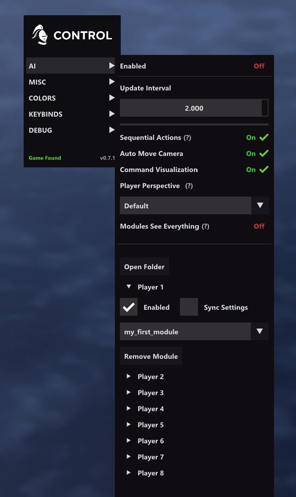

# Interface Options

The CONTROL overlay now manages multiple module instances, each assigned to a specific player slot.

## Module Discovery

CONTROL scans `modules/` recursively for:

- `*.main.lua`
- `*.main.module`

**Depth limit:** 3 levels below `modules/`.

## Global AI Settings

| Setting | Default | Description |
|---------|---------|-------------|
| **Enabled** | On | Master toggle for all configured module instances. |
| **Update Interval** | `1.0` | Seconds between `Update()` calls. |
| **Sequential Actions** | On | Allows only one successful command per update tick. |
| **Auto Move Camera** | On | Auto-centers the camera on executed command targets. |
| **Command Visualization** | On | Draws command feedback overlays. |
| **Player Perspective** | `Default` | Fog-of-war perspective override: `Default`, `Player 1` to `Player 8`, `All Players`, or `Gaia`. |

The update interval is clamped to `0.1` seconds in the UI and `0.01` seconds if edited directly in `settings.ini`.

## Module Items

Use **Add Module** to create a new module instance. Each module item has its own runtime and assigned player.

| Control | Description |
|---------|-------------|
| **Enabled** | Turns this module instance on or off without deleting it. |
| **Sync Settings** | Shares module settings through a named profile instead of per-player settings. |
| **Module** | Selects the module entry point for this instance. Selecting the same module again reloads it. |
| **Player ID** | Chooses which in-game player this module controls. |
| **Settings Profile** | Appears when **Sync Settings** is enabled. Multiple instances can share the same profile. |
| **Create Profile / Remove Profile** | Manages reusable module settings profiles. |
| **Remove Module** | Deletes the instance configuration. |

## Multi-Module Behavior

- Only one enabled module can control a given player at a time.
- Duplicate player assignments are automatically warned about and disabled at runtime.
- Module-created settings panels appear per configured settings group while AI is enabled.
- **Open Folder** opens the modules directory.

## Misc Settings

| Setting | Default | Description |
|---------|---------|-------------|
| **Reveal Map** | Off | Useful when controlling non-local players. Release note: may cause crashes. |
| **Unlock Zoom** | Off | Removes the normal zoom limit. Release note: may cause rendering issues or crashes. |
| **Chat Welcome Message** | On | Enables CONTROL's startup chat message behavior. |

## Perspective Warning

`Player Perspective` can force the fog view of a specific player. This is powerful for debugging and for multi-player-slot control, but the current release notes warn that perspective switching may cause a crash on the next game start.

## Log Window

Use `Log("message")` from Lua to write script messages to the log window.
