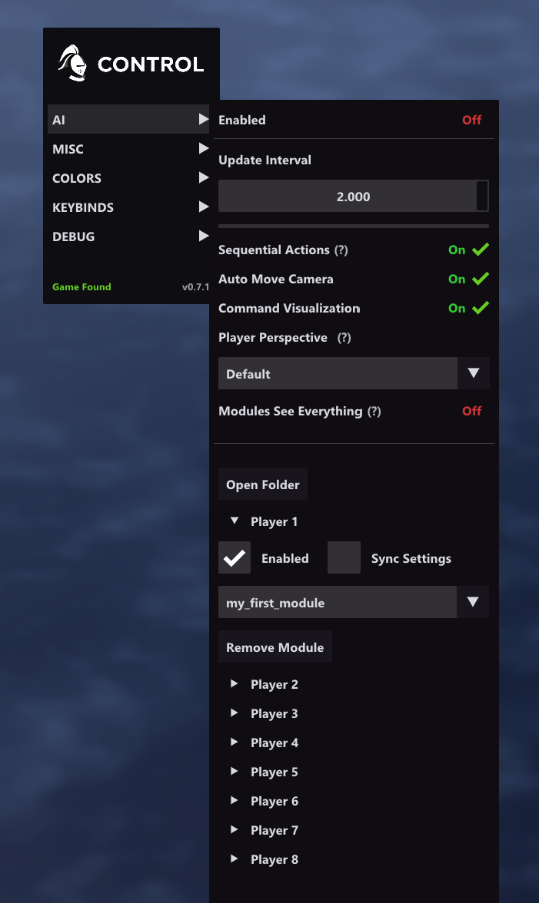

# Interface Options

Press **Shift** to open or close the CONTROL menu. The menu has the submenus MODULES, MISC, UI, KEYBINDS and DEBUG, followed by one submenu for each running module's settings. CONTROL saves every change to `settings.ini` in the [config folder](config-location.md).

## Module Discovery

The **Module** list shows every `{moduleName}.main.lua` and `{moduleName}.main.module` file in the `modules\` folder and up to three folders below it. [Module System](module-system.md#discovery-rules) has the full rules, including what happens when two files have the same name.

## MODULES Submenu

| Setting | Default | Description |
|---------|---------|-------------|
| **Enabled** | On | Turns all module slots on or off. |
| **Update Interval** | `1.0` | Seconds of game time between `Update()` calls. The slider goes from 0.1 to 2.0; a value set in `settings.ini` can be as low as 0.01. |
| **Sequential Actions** | On | Allows one game command per `Update()` call. Further commands in the same call are refused. |
| **Auto Move Camera** | On | Moves the camera to the target of each executed command. Only one module moves the camera: the one on the local player's slot, or else the one with the lowest player number. |
| **Command Visualization** | On | Draws an overlay for each executed command. |
| **Suppress Native AI** | On | Turns off the built-in AI of a computer player while a module is assigned to its slot. |
| **Tournament Mode** | Off | Refuses game commands outside `Update()`, adds `Update()` time above 20 ms to the next interval, and blocks a list of functions. See [Limits](limits.md#tournament-mode). |
| **Multithreading** | Off | Runs each module on its own thread, which reduces the frame-rate cost. `Render()` is not called, and some functions are blocked or return `nil`. See [Limits](limits.md#multithreading). May cause sync issues. |
| **Modules See Everything** | Off | Modules ignore fog of war when they read map tiles, objects and players. See [Perspective And Visibility](#perspective-and-visibility). |
| **Agent Bridge** | Off | Lets a module open the [Agent Bridge](agent-bridge.md) pipe. Any program running under your Windows user can then read the module player's view and send it commands. Not available in multiplayer. |

Changing **Multithreading** reloads every assigned module.

Below the settings, **Open Folder** opens the `modules\` folder, followed by the player sections.

## Player Module Slots

The MODULES submenu has one section for each player, **Player 1** to **Player 8**. Each section is one module slot.

| Control | Description |
|---------|-------------|
| **Enabled** | Turns the slot on or off without clearing the selected module. |
| **Sync** | Stores the module's settings in a shared profile instead of per player, so several slots can use the same values. |
| **Module** | Selects the module for the slot. Selecting the same module again reloads it from its files. |
| **Sync Profile** | Shown when **Sync** is on. Selects the shared profile (`S1`, `S2`, ...). |
| **Create Profile** / **Remove Profile** | Adds a profile for the selected module, or removes the selected one. The last profile cannot be removed. |
| **Remove Module** | Clears the slot. |

A section also shows:

- warnings, such as `Player is not available.` when the assigned player is not in the current match,
- Lua errors from the module,
- in **Tournament Mode**, the slot's current update interval, its added delay and a progress bar.

Each running module gets its own settings submenu, named after the module and its settings group, for example `MY_MODULE [P2]` per player or `MY_MODULE [S1]` for a shared profile. The [Settings API](settings-api.md) adds the controls in it.

## MISC Submenu

| Setting | Default | Description |
|---------|---------|-------------|
| **Player Perspective** | `Default` | Shows the game from another player's view: `Default` (the local player), `Player 1` to `Player 8`, or `Gaia`. May cause crashes. Resets to `Default` when CONTROL starts. |
| **Game Speed Multiplier** | `Default` | Overrides the game speed: `Default`, `1`, `1.5`, `2`, `5`, `10`, `20` or `30`. `Default` keeps the game's own speed. Resets to `Default` when CONTROL starts. `SetGameSpeedMultiplier()` changes this setting. |
| **Spectator Mode** | Off | Shows the whole map, as a spectator sees it. |
| **Unlock Zoom** | Off | Lets you zoom out further than the game allows. May cause rendering issues. |
| **Chat Welcome Message** | On | Sends `[CONTROL] Have fun!` to the chat at the start of each match. |

## UI Submenu

| Setting | Default | Description |
|---------|---------|-------------|
| **Menu Scale** | `1.0` | Menu size: `0.5`, `0.75`, `1.0` or `1.5`, multiplied by the Windows display scale. |
| **Menu Transparency** | `0.05` | Background transparency of CONTROL's windows, from 0 to 0.7. |

## KEYBINDS Submenu

| Setting | Default | Description |
|---------|---------|-------------|
| **Menu Toggle Key** | `Shift` | Opens or closes the CONTROL menu. |
| **Unload Key** | `Delete` | Unloads CONTROL from the game. |

## DEBUG Submenu

The DEBUG submenu has a **Show Log** / **Hide Log** button, the two settings below, and a line with CONTROL's diagnostics status.

| Setting | Default | Description |
|---------|---------|-------------|
| **Module Telemetry** | Off | Shows how long each running module's `Update()` and `Render()` take, and CONTROL's share of each frame. |
| **API Profiling** | Off | Counts each module's calls into CONTROL and Lua library functions and the time they take. Applies to modules loaded or reloaded after it is turned on, and slows them down. |

With **Module Telemetry** on, the submenu shows:

- CONTROL's time per frame, the time between game frames, and CONTROL's share of it,
- **Baseline Frame**: CONTROL's time per frame without module callbacks (hidden with **Multithreading** on),
- one row per running module: the mean, 95th percentile and maximum of `Update()` and `Render()` over the last 256 calls, the mean relative to the baseline, and the update delays that **Tournament Mode** added.

A module can read its own numbers with `GetModuleTelemetry()` whether or not the setting is on. `diagnostics\latest.json` in the config folder has the same report under `moduleTelemetry`.

With **API Profiling** on, `GetModuleTelemetry().api` and each module's `api` list in `diagnostics\latest.json` show how often each native function was called and its total time, by the name used at the call site (`GetPosition`, `format`). A function called from native code, such as one passed directly to `pcall`, appears as `(unnamed)`. Time spent in Lua code is not counted.

## Perspective And Visibility

**Player Perspective** changes what the game draws. **Modules See Everything** changes what modules can read.

With **Modules See Everything** off, a module reads map tiles, objects and players as its assigned player sees them: no objects under fog of war and no hidden data of other players. Animals, trees, forage, gold and stone that the player has explored stay readable when they are out of sight.

## Log Window

**Show Log** in the DEBUG submenu opens the log window. `Log("message")` writes a line to it, prefixed with `[MODULE]`. Lua errors, warnings and CONTROL's own messages appear there too. In **Tournament Mode**, `Log()` does nothing.
