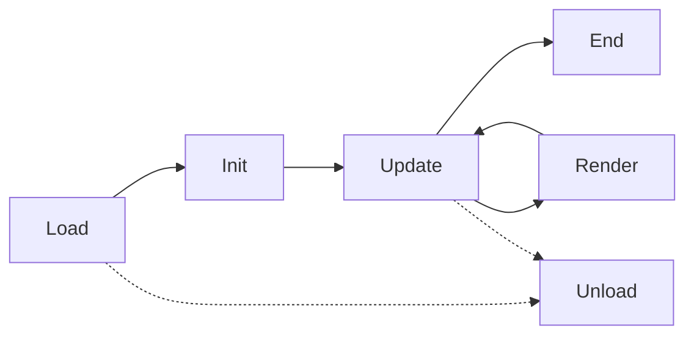

# Lifecycle

Each configured module instance can implement up to six callbacks. All of them are optional.

## Callbacks

### Load

**When:** When the module instance is loaded or when AI becomes active for that instance.

**Signature:** `Load(playerId)`

**Use for:** `Settings.Add*` and other setup that only needs the assigned player id.

**Notes:** `playerId` is the assigned player id for this instance. `GetAssignedPlayerId()` is also available here.

**Do not:** Call in-game state APIs here. `GetAssignedPlayer()` still requires a running match.

### Init

**When:** When the game becomes ready, the world changes, the module is reloaded, or the instance becomes active again.

**Use for:** One-time per-match setup such as `IPC.StartServer()`, cache resets, and other read-only initialization.

### Update

**When:** At the configured update interval while the match is running.

**Use for:** Decision-making, commands, and state updates.

### Render

**When:** Every rendered frame while the match is running.

**Use for:** Overlays, debug drawing, and read-only inspection.

### End

**When:** Once after the match ends. It also runs if a running match is manually exited.

**Parameters:** `hasWon` tells you whether the assigned player won. When the match is stopped by manually exiting, `hasWon` is `false`.

### Unload

**When:** When the module instance is unloaded, disabled, replaced, or the engine is detached.

**Use for:** Cleanup that must also run outside normal match end, such as `IPC.StopServer()`.

## Order

## Notes

- `Load` may run again when an instance is reloaded.
- `Init` runs per module instance, not globally.
- `Update` is the callback intended for game commands. Calling commands from other callbacks logs a warning, and **Tournament Mode** blocks them.
- Manually exiting a running match triggers `End(false)`.
- `Unload` can run without `End` if the user disables AI, removes the instance, switches modules, or ejects CONTROL.
