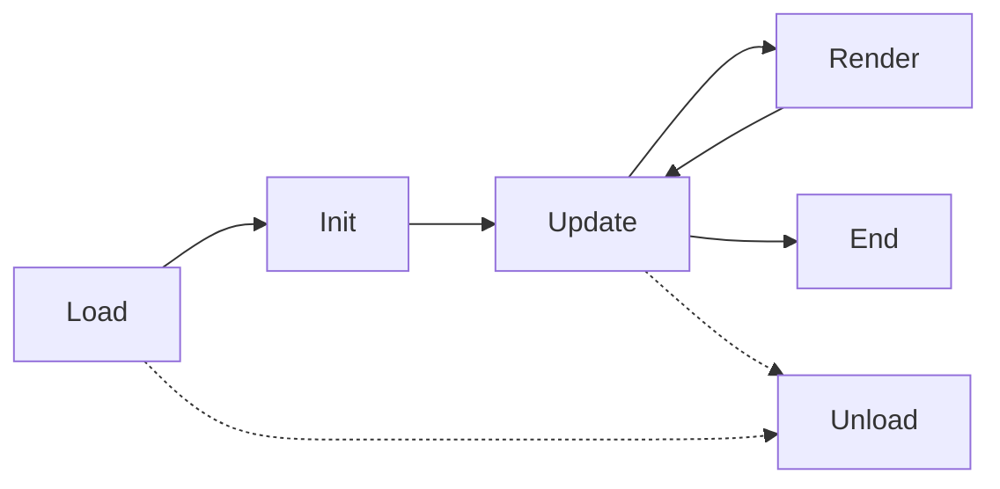

# Lifecycle

The engine invokes your module through six optional callbacks. Implement only the ones you need.

## All Callbacks Optional

Modules can omit any callback. For example, `ipc_test` has no `Load` because it uses no Settings.

## Callbacks

### Load

**When:** When the module is selected/loaded, or when the AI enabled setting is switched on.

**Use for:** `Settings.Add*` only. Register checkboxes, sliders, dropdowns, keybinds, colors, etc. The engine calls `settings::Load()` after `Load()` returns. Module settings registered here are only shown in the UI while AI is enabled.

**Do not:** Call game API (game may not be running yet).

### Init

**When:** When the game is ready, world changed, module reloaded, or AI enabled.

**Use for:** One-time setup (e.g. `IPC.StartServer`, `ChatLocal`).

### Update

**When:** At a configurable interval (default 1.0s) while the game is running.

**Use for:** Main game logic — commands, decisions, state updates.

### Render

**When:** Every frame while the game is running.

**Use for:** Drawing overlays — shapes, text, minimap markers.

### End

**When:** Once when the game ends.

**Parameters:** `hasWon` (boolean) — whether the local player won.

**Use for:** Cleanup, logging, IPC shutdown (e.g. `IPC.StopServer()`).

### Unload

**When:** When the module is unloaded, the AI setting is disabled, or the engine is ejected.

**Use for:** IPC cleanup (e.g. `IPC.StopServer()`), releasing resources, or notifying external clients. Unlike `End`, `Unload` runs even when the game has not ended — for example, when the user switches modules, disables AI, or detaches the engine.

## Timing Diagram

- **Load** runs once when the module is selected.
- **Init** runs when entering a game.
- **Update** and **Render** run in a loop until the game ends.
- **End** runs once when the game ends.
- **Unload** runs when the module is unloaded, AI is disabled, or the engine is ejected.
