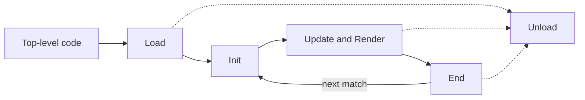

# Lifecycle

A module defines up to six global functions: `Load`, `Init`, `Update`, `Render`, `End` and `Unload`. All of them are optional. CONTROL looks them up by name after the entry file's top-level code has run, so define them as globals (`function Update()`, not `local function Update()`).

Each player slot runs its own copy of the module with its own Lua state. Two slots that run the same module do not share variables.

## Callbacks

### Load

**When:** When the slot becomes active after the module file is loaded. A slot is active when it is turned on, **Enabled** in the MODULES menu is on, and the assigned player is in the current match (outside a match, every player counts as present). This can happen in the main menu, before any match.

**Signature:** `Load(playerId)`. `playerId` is the slot's player number, 1 to 8. `GetAssignedPlayerId()` returns the same number.

**Use for:** `Settings.Add*` calls and setup that needs only the player number.

**Do not:** Rely on game state. Outside a match, game functions log `Game API function called before the game started` and return `nil` or a default value.

### Init

**When:** Once per match, when the match is running and its game time is above 0. It runs again for the next match, and right away when you reload the module or turn its slot back on during a match.

**Use for:** Per-match setup: reset caches, read the map, start an IPC server with `IPC.StartServer()`.

### Update

**When:** Every **Update Interval** seconds of game time (MODULES menu, default 1.0) while a match is running. It does not run while the game is paused, and runs more often in real time at higher game speeds.

**Use for:** Decisions and game commands. Game commands belong here; see [Commands outside Update](#commands-outside-update).

If the game falls behind by more than one interval, the missed updates are dropped, not run back to back. `GetModuleTelemetry()` counts them in `skippedIntervals`.

In **Tournament Mode**, the part of an `Update()` call above 20 ms is added to the next interval.

### Render

**When:** Every frame while a match is running, after `Init()`. It is not called while **Multithreading** is on.

**Use for:** Drawing with the [Render API](render-api.md). Draw functions (`Render*`) raise an error when called from any other callback. In **Tournament Mode** they do nothing.

### End

**Signature:** `End(hasWon)`

**When:** Once per match: when the match or replay ends, or when the player leaves a running match.

**Parameters:** `hasWon` is `true` when the assigned player won. It is `false` when the player leaves the match and at the end of a replay.

**Use for:** Final reads and cleanup. Game state can still be read while the end screen is shown. Game commands do nothing here.

### Unload

**When:** Once when the module stops running in its slot:

- the slot or **Enabled** in the MODULES menu is turned off, or the assigned player is not in the current match,
- another module is selected, the module is removed, or the same module is selected again to reload it,
- CONTROL is unloaded.

**Use for:** Cleanup that must also run when no match ended, such as `IPC.StopServer()`.

`Unload` can run without `End`, for example when you turn a slot off during a match. When the slot becomes active again, `Load()` runs again and the module keeps its variables. Selecting the module again in the **Module** list reloads it from its files.

## Order

```mermaid
flowchart LR
    F["Top-level code"] --> L["Load"]
    L --> I["Init"]
    I --> U["Update and Render"]
    U --> E["End"]
    E -->|next match| I
    L -.-> Un["Unload"]
    U -.-> Un
    E -.-> Un
```

The entry file's top-level code runs when the module is loaded: when you select it, when CONTROL starts with it assigned, and when you reload it. `require` calls at the top level run at the same time.

## Errors

- A Lua error in the top-level code or any callback is shown in the player's section of the CONTROL menu and written to the log.
- After an error in `Update()` or `Render()`, CONTROL stops calling that function until the module is reloaded.
- A callback, including the top-level code, that runs longer than 1 second is stopped with an error. See [Limits](limits.md#callback-time-limit).

## Commands outside Update

Game commands (the Commands section of the [Game API](commands.md)) are meant for `Update()`.

- When **Tournament Mode** is off, a command called from another callback still runs, and CONTROL logs a warning once per module load.
- When **Tournament Mode** is on, CONTROL refuses it and logs an error once per module load.
- During a replay, commands are refused.
